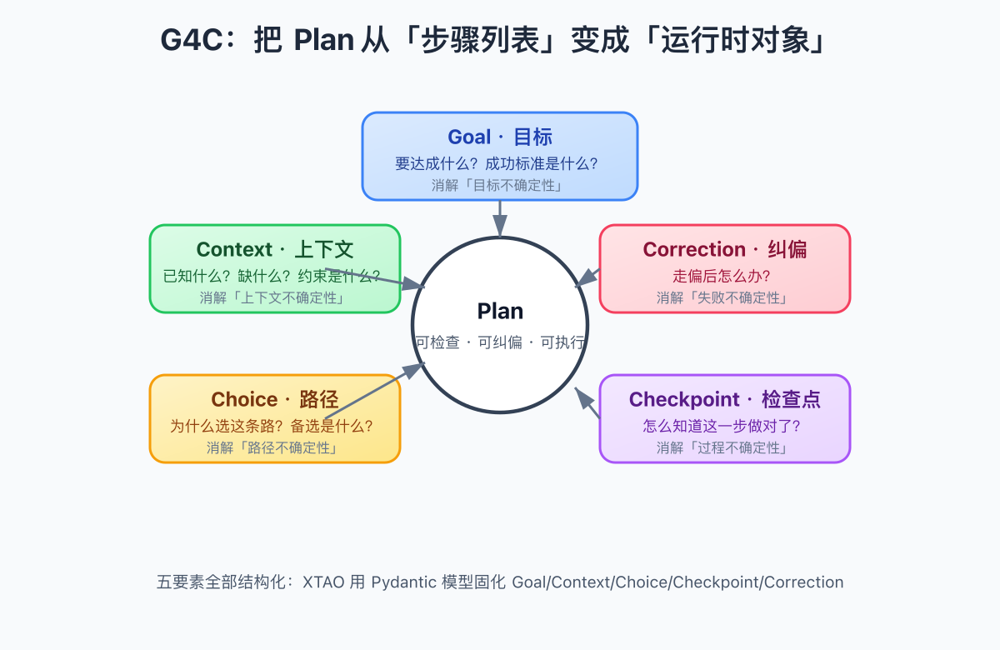
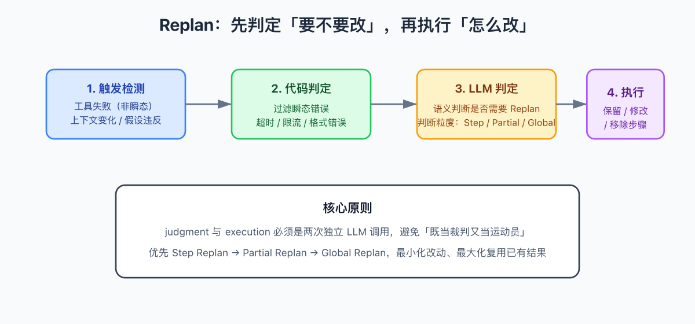
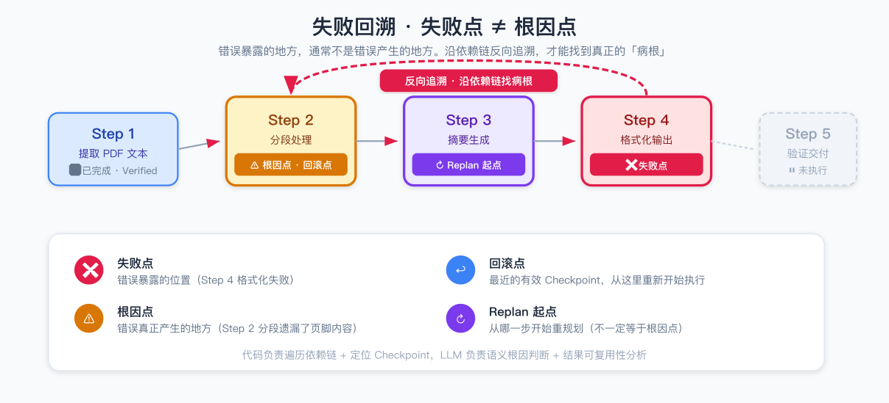
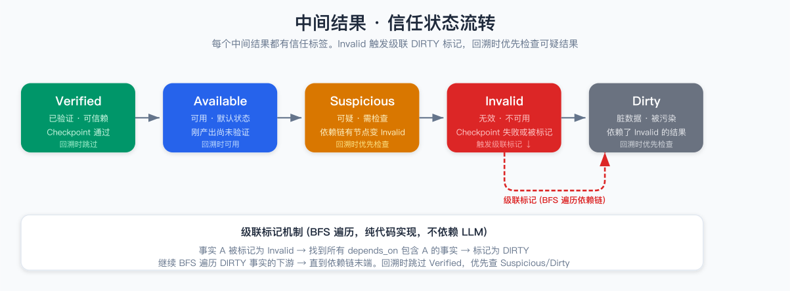
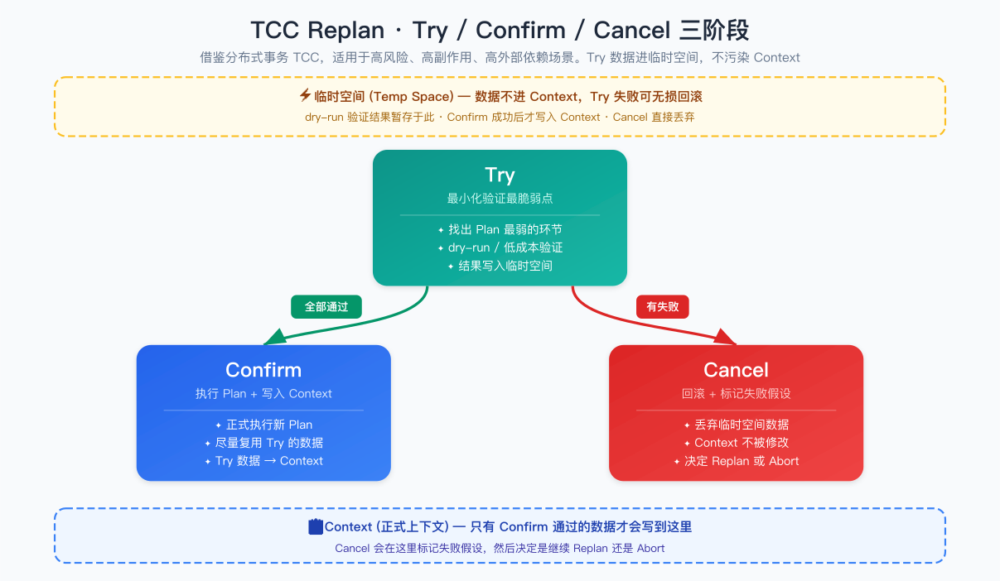

# 我把 Agent 的 Plan 做成了「运行时对象」，它终于不会在半路上自己跑偏了

> **编者按**，本文来自一个真实开源项目的复盘，写的是一套叫 **XPlan** 的 Agent Plan 机制。读完这篇，你会对「为什么 Agent 做着做着就偏了」「怎么让 Plan 自己知道错了还知道怎么改」有一个完全不一样的理解。

---

## 一、故事是这样的

最近这两个月，我一直在跟 Agent 的 Plan 较劲。

事情的起因特别具体，我手里有一个自动处理 PDF 的工作流，原本想得挺美好，用户丢进来一份财报，Agent 先读、再总结、再生成图表、最后输出一份一页纸的摘要。结果跑起来以后，bug 接踵而至。

比如，财报里某一页的页脚有补充说明，Agent 在「分段」那一步把它漏了，到「摘要」那一步自然就少了关键数字。但日志里报错的位置，是最后格式化输出那一环。我当时就愣住了。

我盯着错误信息看了半天，差点直接去改格式化模块。后来冷静下来才意识到，**失败点不等于根因点**。格式化那一步只是老老实实地把脏数据输出了，真正的病根在更早的分段那一步。

这种体验，做 Agent 的人应该都懂。

我们太习惯把 Plan 当成一个「步骤列表」去执行，只要有一步走不通，就局部修一下。但真正的麻烦不是某一步报错，而是前面某一步已经悄悄错了，后面的所有步骤都在这个错的地基上继续盖楼。等到大楼塌了，你才发现地基有问题。

所以，我设计 XPlan 的时候，有一个最核心的假设，

**Plan 不应该是一个步骤列表，而应该是一个可检查、可纠偏、可执行的运行时对象。**

---

## 二、G4C，五个问题逼你把 Plan 想清楚

我把这套方法叫做 **G4C**，五个字母分别对应 Goal、Context、Choice、Checkpoint、Correction。

它看起来像是五个抽象的概念，但每一环都是冲着一种「不确定性」去的。



**Goal · 目标**。做 Plan 之前先回答，到底要达成什么，成功的标准是什么。没有明确成功标准的 Plan，就是一台没有目的地的自动驾驶汽车。

**Context · 上下文**。已知什么，缺什么，有什么硬约束、软约束。Agent 不能靠猜。

**Choice · 选择**。为什么选这条路，而不是另外一条。必须基于 Context 里的证据给出理由，而不是模模糊糊地说「这样比较好」。

**Checkpoint · 检查点**。怎么知道这一步做对了。里程碑、关键中间输出、容易出错的地方，都必须设检查点。

**Correction · 纠偏**。一旦发现偏离，Plan 自身要知道怎么处理，而不是等人在屏幕前救场。

五个问题回答完，Plan 才从「看上去合理」变成「真的能跑」。

在 XPlan 的代码里，这五个要素被固化成 Pydantic 模型，下面这一段是 Plan 复合对象的核心结构，

```python
from xplan.models import Goal, Context, Choice, Checkpoint, Correction

class Plan(BaseModel):
    """Plan runtime object, contains five G4C elements.

    Attributes:
        goal: What to achieve and how to judge success.
        context: Known facts, missing info, and hard/soft constraints.
        choice: Selected path, reasons, and executable steps.
        checkpoints: How to verify each key step.
        corrections: Recovery strategies when deviation occurs.
    """
    goal: Goal
    context: Context
    choice: Choice
    checkpoints: list[Checkpoint]
    corrections: list[Correction]
    mode: PlanMode = PlanMode.LINEAR      # linear or DAG
    status: PlanStatus = PlanStatus.READY # ready/running/completed/failed
```

`Plan` 不是一个 JSON 配置，它是一个有状态的对象。执行过程中，status 会变，checkpoint 结果会累积，信任状态会流转。你想想看，**Plan 是活的。**

---

## 三、Replan，不是重写，而是「可控修正」

Plan 再完美，也架不住执行时遇到意外。用户临时加需求、工具超时、Checkpoint 没通过，这些情况都会发生。

传统的做法是什么？重试。重试三次不行就报错，让用户自己想办法。

但这太浪费了。很多错误不是不能修，而是不知道怎么修。XPlan 的做法是 **Replan，可控修正**。

它的流程分成两个明确的阶段，**判定阶段** 和 **执行阶段**。



### 判定阶段：先让代码过滤，再让 LLM 判断

第一步是 **触发检测**。Replan 有三种触发时机，

- 工具调用失败（非瞬态错误）
- 上下文变化（用户加了约束或补充了信息）
- 假设违反（Checkpoint 没通过）

第二步是 **代码判定**。代码负责把瞬态错误筛掉，比如网络超时、API 限流，这些直接重试就行，不需要上升到 Replan。

第三步是 **LLM 判定**。如果代码判定认为不是瞬态错误，就交给 LLM 做语义判断，决定是否需要 Replan，以及需要哪种粒度。

这一步和下一步执行，**必须是两次独立的 LLM 调用**。judgment 和 execution 绝不能混在一起。为什么？因为一旦混在一起，LLM 又当裁判又当运动员，结果经常是「它觉得自己没问题，于是就没问题」。

在代码里，ReplanEngine 的入口长这样，

```python
class ReplanEngine:
    """Core correction engine with dual judgment and three granularities."""

    async def judge(self, error, plan, user_input="") -> ReplanJudgment:
        """Phase 1, judgment only. Decide IF and HOW to replan.

        Steps:
            1. detect_trigger: find what triggered the deviation.
            2. code_judge: filter transient errors (timeout, rate limit).
            3. llm_judge: semantic judgment on uncertain cases.

        Returns a ReplanJudgment, never executes a new plan.
        """
        trigger = self.detect_trigger(error, plan, user_input)
        if trigger is None:
            return ReplanJudgment(needs_replan=False)

        code_result = self.code_judge(trigger, error)
        if not code_result.needs_replan:
            return code_result   # transient error, retry is enough

        return await self.llm_judge(trigger, plan, user_input)
```

### 执行阶段：三种粒度，能轻则轻

LLM 判定完，进入执行阶段。XPlan 把 Replan 分成三种粒度，

**Step Replan**。只改当前这一步，前面的结果全部保留。成本最低。

**Partial Replan**。回滚到某个指定步骤，从那里开始重规划，但该步骤之前的结果仍然复用。

**Global Replan**。从零生成一份新 Plan。这是最后的手段。

优先级永远是 **Step → Partial → Global**。原则就一句话，**最小化改动范围，最大化复用已有结果。**

代码里的 ReplanResult 会明确记录每一步的命运，

```python
class ReplanResult(BaseModel):
    """Result of executing a replan.

    Every step change must be evidence-based.
    """
    retained_steps: list[StepChange]   # unchanged, keep running results
    modified_steps: list[StepChange]   # need to rerun with updates
    removed_steps: list[StepChange]    # no longer needed
    new_plan: Plan | None
    replan_info: ReplanInfo            # max_replan_total / used_replan_total
```

`replan_info` 是防止无限循环的关键。`max_replan_total` 默认是 3，`used_replan_total` 每 Replan 一次就加 1，达到上限后强制进入人工确认或 Abort。

---

## 四、失败回溯，找到真正的「病根」

回到开头那个 PDF 的例子。

格式化那一步报错了，但我真正需要知道的是，这个错误是从哪一步开始引入的。XPlan 的 **FailureTracer** 就是干这个事的。

它的核心假设是，**失败点 ≠ 根因点 ≠ 回滚点 ≠ Replan 起点。**



这四个概念必须分开，

- **失败点**，错误暴露的位置，比如 Step 4 格式化失败。
- **根因点**，错误真正产生的地方，比如 Step 2 分段遗漏了页脚。
- **回滚点**，最近一个有效的 Checkpoint，从这里重新执行。
- **Replan 起点**，从哪一步开始重规划，不一定等于根因点，通常选择能复用结果的最晚位置。

FailureTracer 的分工很明确，**代码负责确定性操作，LLM 负责语义判断。**

代码做的事情包括，

- 沿依赖链反向遍历，构建回溯链。
- 找到最近的 Checkpoint。
- 检测循环依赖。

LLM 做的事情包括，

- 语义层面的根因定位。
- 判断目标是否发生变化。
- 分析约束影响。
- 判断中间结果能否复用。

在 XPlan 里，调用一次回溯只需要一个请求，

```python
async def trace(
    self,
    plan: Plan,
    failure_step_id: str,
    failure_info: str,
    step_records: list[StepRecord],
) -> FailureTracingResult:
    """Trace failure from failure point back to root cause.

    Code builds the tracing chain, LLM localizes the root cause semantically,
    then we merge both into a FailureTracingResult.
    """
    chain = self.build_tracing_chain(plan, failure_step_id)
    nearest_checkpoint = self.find_nearest_checkpoint(chain)
    circular = self.check_circular_dependency(plan)

    llm_result = await self.llm_trace_root_cause(
        chain, failure_info, step_records, nearest_checkpoint, circular
    )
    return self.merge_results(chain, nearest_checkpoint, llm_result)
```

这种分层的意义在于，LLM 很贵、很慢、还不稳定，所以能交给代码的绝不交给 LLM。LLM 只处理「这个错误到底是因为语义理解错了，还是工具参数错了」这种非确定性问题。

---

## 五、信任状态，给每个中间结果贴标签

Plan 执行过程中会产生大量中间结果，比如「PDF 有 3 页」「文本长度 4500 字符」「摘要包含 5 个要点」。这些结果不是生下来就平等的。

XPlan 给每个中间结果打了一个 **信任状态**，



五种状态分别是，

- **VERIFIED**，已经过 Checkpoint 验证，可信。
- **AVAILABLE**，已产出但还没验证，默认可用。
- **SUSPICIOUS**，可疑，需要检查。
- **INVALID**，无效，不可用。
- **DIRTY**，被污染，因为它的上游有 INVALID 的事实。

最关键的机制是 **级联标记**。当一个事实被标记为 INVALID，代码会通过 BFS 遍历依赖链，把所有依赖它的事实标记为 DIRTY。

```python
class TrustStateManager:
    """Manages trust state of intermediate results with cascade marking."""

    def update_trust_state(self, key, new_state, reason="") -> list[TrustStateChange]:
        """Update trust state of a fact.

        If new_state is INVALID, all downstream facts that depend on it
        are automatically marked as DIRTY via BFS (pure code, no LLM).
        """
        changes = [TrustStateChange(key=key, old=self._facts[key].trust_state, new=new_state)]
        self._facts[key].trust_state = new_state

        if new_state == TrustState.INVALID:
            queue = deque([key])
            while queue:
                current = queue.popleft()
                for dep_key, entry in self._facts.items():
                    if current in entry.depends_on and entry.trust_state != TrustState.DIRTY:
                        entry.trust_state = TrustState.DIRTY
                        changes.append(TrustStateChange(key=dep_key, old=entry.trust_state, new=TrustState.DIRTY))
                        queue.append(dep_key)
        return changes
```

注意，级联标记是纯代码实现的，不依赖 LLM。因为遍历依赖图这件事，图算法比 LLM 快、准、稳。

回溯的时候，FailureTracer 会优先看 SUSPICIOUS 和 DIRTY 的事实，跳过 VERIFIED。这样就避免了在已经验证过的地方浪费时间。

---

## 六、TCC Replan，高风险场景的安全网

有些场景，不能一上来就真刀真枪地执行。比如涉及资金转账、文件删除、公开发布这种操作，一旦错了代价很高。

XPlan 提供了一个可选的高级机制，**TCC Replan**，借鉴了分布式事务的 Try / Confirm / Cancel 思想。



三个阶段分别是，

**Try**。找出新 Plan 里最脆弱的环节，做最小化、低成本的 dry-run 验证。Try 的结果写入临时空间，不污染 Context。

**Confirm**。如果所有 Try 都通过，正式执行 Plan，并把 Try 数据复用到 Context。

**Cancel**。如果 Try 失败，直接丢弃临时空间的数据，在 Context 里标记失败的假设，然后决定是继续 Replan 还是 Abort。

TCC 默认是关闭的，只有显式开启才会生效。这符合 XPlan 的设计哲学，**简单场景用简单方案，复杂场景才加复杂方案。**

---

## 七、主入口 /api/plan/run，把整个生命周期串起来

XPlan 对外暴露了 30 多个 REST 接口，但真正推荐用的是 **POST /api/plan/run**。它是一个主入口，内部把生成、评估、执行、纠偏全部串起来。

流程大概是这样，

```
/api/plan/run
  ├── 生成 Plan (G4C 五要素)
  ├── 可选：评估 Plan (G4C 五维评分)
  ├── 执行 Plan (逐步骤 + Checkpoint)
  │     如果 Checkpoint 失败
  │     ├── FailureTracer.trace() 定位根因
  │     ├── TrustStateManager 标记 INVALID/DIRTY
  │     ├── BacktrackingEngine 渐进式回溯
  │     ├── ReplanEngine / TCCReplan 生成新 Plan
  │     └── ReplanEvaluator 记录事件
  └── 返回 OrchestratorResult
```

也就是说，单个接口内部调用了多个子系统，但对外只暴露一个统一的调用方式。这种设计的好处是，普通用户不用关心底层细节，一个请求就能跑完整个生命周期。

如果你想自己控制每一步，也可以直接调用下面的原子接口，

```python
from xplan.sdk import XPlanClient

async with XPlanClient(base_url="http://localhost:8000") as client:
    # One-shot full lifecycle
    result = await client.run_plan(
        user_input="Summarize the 3-page report into 5 bullets",
        config={"max_replan_count": 2},
    )

    # Or call atomic endpoints manually
    plan = await client.generate_plan("Summarize the report")
    score = await client.verify_plan(plan)
```

SDK 复用了 `xplan.models` 里的 Pydantic 模型，所以你可以直接传模型实例，不用手写 JSON。

---

## 八、Replan 效果怎么评估？

修好了不等于修对了。XPlan 给 Replan 设计了五维评估指标，

- **根因定位准确率**，FailureTracer 找根因点找得准不准。
- **Replan 起点准确率**，从哪一步开始重规划是否合理。
- **已有结果复用率**，原来计算过的中间结果有多少被保留。
- **Replan 恢复成功率**，Replan 之后整体任务是否成功完成。
- **Replan 振荡率**，有没有出现反复 Replan 的抖动现象。

这几项指标合起来，才能回答「这个 Replan 到底靠不靠谱」。

其中复用率是我个人特别在意的一项。因为它直接决定了 Replan 的成本。复用率低，说明每次出错都在从头算，那 Replan 的意义就小了很多。

---

## 九、TAO，让每一步都会「想一想」再走

前面讲的 G4C 和 Replan 解决的是「Plan 层面」的问题--怎么生成好的 Plan，怎么在出错时修正 Plan。但还有一个更细粒度的问题：**Plan 的每一步在执行时，Agent 是怎么走的？**

传统的做法是，拿到步骤目标，直接调工具，拿到结果，走下一步。这就像蒙着眼睛走路--走到哪算哪，出了问题也不知道是哪一步偏了。

XPlan 引入了 **TAO（Think-Action-Observation）** 循环来解决这个问题。

### 五类结构化判断，每一步都想清楚

每一轮 TAO 循环，Think 引擎会做五类判断，

1. **目标判断**：当前目标是什么？和最终目标还差多远？成功标准满足了吗？
2. **状态判断**：已知的事实够不够？有没有缺失的信息？有没有未验证的假设？有没有事实冲突？
3. **路径判断**：候选动作空间里选哪个？为什么选这个？参数是什么？
4. **停止判断**：该不该停下来？通过哪个出口退出？（continue / finish / clarify / retry / replan / interrupt）
5. **风险判断**：有没有违反硬约束的风险？

这五类判断就像一个人的内心独白：我在哪？我要去哪？我该走哪条路？要不要停？有没有危险？

### Action 不是 Tool，是目标导向的抽象

TAO 里的 Action 不是裸的工具调用，而是面向目标的操作封装。设计 Action 时有几条核心原则，

- **业务完整性**：一个 Action 要完成一个业务上完整的操作，内部可以调一个工具、多个工具，甚至启动一个子 Agent。
- **正交性**：Action 之间的职责边界要清晰，尽量减少重叠。
- **子 Agent 封装**：复杂子任务可以封装成子 Agent，主 Agent 通过 Action 启动它。
- **参数/返回值最小化**：参数要容易获取，返回值只暴露调用方需要的信息，避免 Observation 解读困难。

它有四种类型，

- **tool_call**：调用外部工具
- **internal_api**：调用系统内部接口
- **user_interaction**：向用户提问
- **aggregate**：组合多个子动作

为了让大模型选得准，每个 Action 还可以带上丰富的元数据，比如 `tags`（标签）、`intents`（意图）、`applicable_scenarios`（适用场景）、`inapplicable_scenarios`（不适用场景）、`permissions`（权限）、`cost`（成本）、`risk`（风险）、`alternatives`（替代工具）等。

执行前的筛选是一条流水线，

```
全部 Action → 意图/标签筛选 → 规则引擎 → 前置条件/权限 → 历史成功率 → 信息增益 → 大模型粗筛 → 大模型精筛 → 最终 Action
```

- 代码先做确定性筛选：意图、标签、前置条件、权限，筛不掉的再交给 LLM。
- 历史成功率低的 Action 会被降权或临时禁用。
- 信息增益高的 Action（能补足缺失信息）会优先排前。
- 粗筛用 Fast LLM 和少量上下文，精筛用 Pro LLM 和完整上下文，兼顾成本和准确率。

执行时还要再次检查：Action 是否在候选空间、必填参数是否提供、权限是否满足、参数是否符合 schema。硬约束永远不能跳过。

### Observation，把原始输出变成证据绑定的事实

Action 执行完，拿到的是原始输出。但原始输出不等于事实。Observation Interpreter 会做几件事，

- 判断执行状态（成功还是失败）
- 提取新事实，每条事实都要绑定证据来源
- 识别信息缺口
- 检测异常

这里有一个关键设计：**HTTP 200 不等于真正的成功**。工具返回了数据不代表数据是对的。Observation 要做空数据检测、异常识别，防止把垃圾数据当事实写回状态。

### 双层循环，内层推进，外层监督

TAO 还有一个双层循环设计，

**内层循环**：Think -> Action -> Observation，负责推进当前任务。

**外层循环**（可选）：每隔 N 轮内层循环触发一次监督检查，看有没有目标漂移、约束违反、或者停滞不前。

外层循环可以是同步的（每 N 轮触发一次），也可以是异步的（独立任务，通过信号队列发送干预）。异步模式下，外层循环不会阻塞内层循环的执行。

```python
class TAOEngine:
    """TAO controlled state loop with double-layer supervision."""

    async def run(self, user_input, candidate_actions, ...):
        """Inner loop: Think -> Action -> Observation.
        Outer loop: supervisor checks goal drift every N rounds.
        """
        while True:
            think = await self.think_engine.think(state)
            exit = self.loop_controller.decide(state, think)
            if exit in (CONTINUE, RETRY):
                await self._execute_round(state, think, exit)
            # Outer loop supervision
            if used_loops % supervisor_interval == 0:
                review = await self.supervise(state)
                if review.intervention != NONE:
                    return self._build_result(state, review)
```

### TAO 质量评估

和 Replan 一样，TAO 也有自己的评估体系，分四层，

- **Think 指标**：动作选择准确率、参数准确率、目标判断准确率等
- **Action 指标**：执行成功率、响应时间
- **Observation 指标**：事实提取准确率、证据绑定准确率、工具结果误读率等
- **整体指标**：最终任务成功率、平均 TAO 轮数、平均工具调用次数

支持 LLM as Judge 自动评估，也支持导入人工金标答案做对比。

---

## 十、这个项目带给我的最大体会

写到这里，我想坦白一个感受。

我之前对 Agent 的期待有点天真，总觉得给它一个目标，它自己就能一路跑下去。但现实的复杂性在于，**执行过程中的信息会变化，目标会模糊，工具会失败，连用户自己都未必一开始就知道自己要什么。**

所以 Plan 不能是一份死的剧本。它必须是一份活的、能自我感知的运行时对象。

XPlan 想做的就是这样一件事。G4C 让它想清楚，Checkpoint 让它能感知，Replan 让它能修正，FailureTracer 让它能找到真正的根因，TrustStateManager 让它知道哪些结果还能信。

这些机制加在一起，Agent 才不会在错误的路上越跑越远。

---

## 十一、如果你想试试

XPlan 已经开源，项目地址在这里，

> GitHub https://github.com/xiaoyesoso/XPlan

启动服务很简单，

```bash
# 1. 复制环境变量模板
cp .env.example .env
# 填入你的 SiliconFlow API_KEY 和模型配置

# 2. 安装依赖并启动
python -m venv .venv
source .venv/bin/activate
pip install -e ".[dev]"
python -m uvicorn xplan.main:app --host 0.0.0.0 --port 8000
```

然后就可以用 SDK 或者 curl 调用 `/api/plan/run`。

---

## 写在最后

这套方案不是万能的。它让 Plan 更鲁棒，但没有让 Agent 变得更聪明。真正决定上限的，还是 Goal 定义得清不清楚，Context 给得全不全，LLM 的判断稳不稳定。

但我也确实觉得，比起之前那种「生成一份步骤列表然后祈祷它能跑完」的做法，XPlan 至少让 Agent 在执行过程中有了一张地图、一套体检机制、和一个急救包。

它不是让 Plan 不再失败，而是让 Plan 在失败时知道自己在哪，以及该怎么回到正轨。

这可能就是 Agent 从「能跑」走向「能信」的关键一步吧。

---

以上，既然看到这里了，如果觉得不错，随手点个赞、在看、转发三连吧，如果想第一时间收到推送，也可以给我个星标⭐～

谢谢你看我的文章，我们，下次再见。
