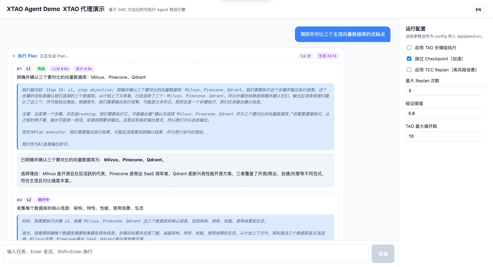
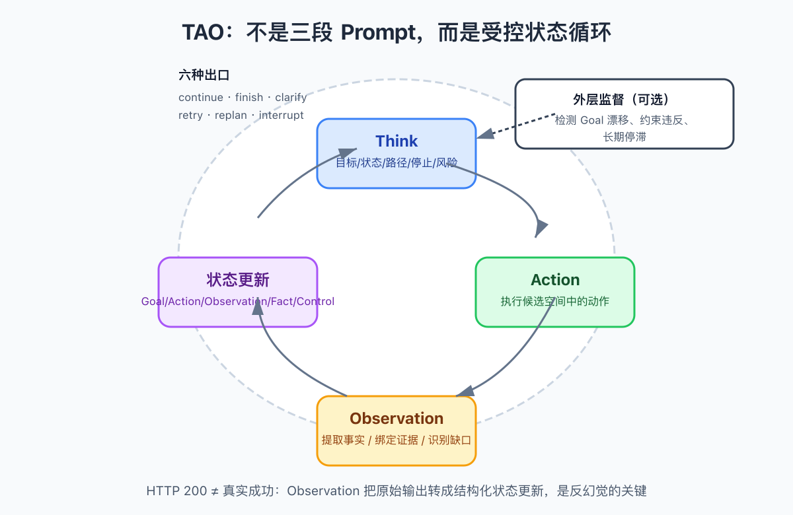
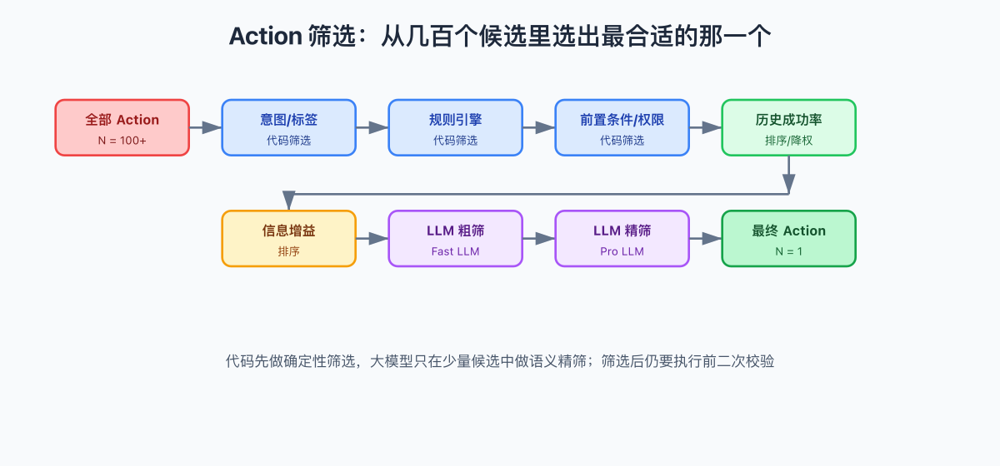

# Agent 跑偏这件事，我忍了很久了

> **编者按**，本文来自一个真实开源项目的复盘，写的是一套叫 **XTAO** 的 Agent 规划与执行框架。它用 **G4C** 做 Plan 生成，用 **TAO（Think-Action-Observation）** 做步骤级执行，用 **Replan** 做执行中的自我修正。读完这篇，你会对「为什么 Agent 做着做着就偏了」「怎么让 Plan 自己知道错了还知道怎么改」有一个完全不一样的理解。
>
> GitHub 地址，https://github.com/xiaoyesoso/XTAO

---

Agent 跑偏这件事，我忍了很久了。

每次看着 Agent 做着做着就偏离目标，日志里报的错跟真正的病根隔了十万八千里，我就一阵头大。忍了很久，终于忍不了了，决定自己动手搞一套。

起因特别具体。我手里有一个自动处理 PDF 的工作流，原本想得挺美好，用户丢进来一份财报，Agent 先读、再总结、再生成图表、最后输出一份一页纸的摘要。结果跑起来以后，bug 接踵而至。

印象最深的一次，财报里某一页的页脚有补充说明，Agent 在「分段」那一步把它漏了，到「摘要」那一步自然就少了关键数字。但日志里报错的位置，是最后格式化输出那一环。我当时就愣住了。

我盯着错误信息看了半天，差点直接去改格式化模块。后来冷静下来才意识到，**失败点不等于根因点**。格式化那一步只是老老实实地把脏数据输出了，真正的病根在更早的分段那一步。。。

这种体验，做 Agent 的人应该都懂。

我们太习惯把 Plan 当成一个「步骤列表」去执行，只要有一步走不通，就局部修一下。但真正的麻烦不是某一步报错，而是前面某一步已经悄悄错了，后面的所有步骤都在这个错的地基上继续盖楼。等到大楼塌了，你才发现地基有问题。

所以我自己搞了一套叫 XTAO 的框架，开源了。说实话我也不确定这套方案是不是最优解，但至少跑下来，Agent 终于不会在半路上自己跑偏了。

先看看它跑起来长什么样。在聊天框输入任务，Agent 会先生成 Plan，再逐步执行，整个过程实时流式输出，包括 LLM 的推理过程都能看到。



界面支持中英文切换，每一步的耗时也有实时显示。看着它一步一步想清楚、走过去、走完了还自己检查一遍，那种感觉太爽了。

好，界面看完了，下面聊聊它背后到底做了什么。

我设计 XTAO 的时候，有两个最核心的判断。

第一，**XTAO 要解决的不仅是 Agent 的「规划」问题，更是 Agent 的「执行」问题**。生成一份好 Plan 只是起点，真正的挑战在于 Plan 跑起来之后，如何感知偏差、定位根因、自我修正。

第二，**Plan 不应该是一个步骤列表，而应该是一个可检查、可纠偏、可执行的运行时对象。**

你想想看，Plan 是活的。它在执行过程中 status 会变，checkpoint 结果会累积，信任状态会流转。它不是一份死的剧本，它是一份能自我感知的运行时对象。

---

我把生成 Plan 的这套方法叫做 **G4C**，五个字母分别对应 Goal、Context、Choice、Checkpoint、Correction。


每一环都是冲着一种「不确定性」去的。

Goal 回答的是，到底要达成什么，成功的标准是什么。没有明确成功标准的 Plan，就是一台没有目的地的自动驾驶汽车。

Context 回答的是，已知什么，缺什么，有什么硬约束、软约束。Agent 不能靠猜。

Choice 回答的是，为什么选这条路，而不是另外一条。必须基于 Context 里的证据给出理由，而不是模模糊糊地说「这样比较好」。

Checkpoint 回答的是，怎么知道这一步做对了。里程碑、关键中间输出、容易出错的地方，都必须设检查点。

Correction 回答的是，一旦发现偏离，Plan 自身要知道怎么处理，而不是等人在屏幕前救场。

在 XTAO 的代码里，这五个要素被固化成 Pydantic 模型，Plan 复合对象的核心结构长这样。

```python
# src/xtao/models/plan.py
class Plan(BaseModel):
    goal: Goal                      # 目标与成功标准
    context: Context                # 上下文与约束
    choice: Choice                  # 路径决策与步骤
    checkpoints: list[Checkpoint]   # 检查点列表
    corrections: list[Correction]   # 纠偏规则列表
    mode: PlanMode = PlanMode.LINEAR      # linear or DAG
    status: PlanStatus = PlanStatus.READY # ready/running/completed/failed
```

坦率的讲，一开始我也没想搞这么重。但跑了几轮下来发现，如果 Plan 本身不知道自己要什么（Goal 缺失）、不知道约束在哪（Context 缺失）、不知道怎么算对了（Checkpoint 缺失），那执行引擎再强也是白搭。五要素不是过度设计，是被现实毒打出来的。说真的，这个坑我踩了好几次才想明白。

---

Plan 再完美，也架不住执行时遇到意外。用户临时加需求、工具超时、Checkpoint 没通过，这些情况都会发生。

传统的做法是什么？重试。重试三次不行就报错，让用户自己想办法。

但这太浪费了。很多错误不是不能修，而是不知道怎么修。XTAO 的做法是 **Replan，可控修正**。

它的流程分成两个明确的阶段，判定阶段和执行阶段。


判定阶段的第一步是触发检测。Replan 有三种触发时机，工具调用失败（非瞬态错误）、上下文变化（用户加了约束或补充了信息）、假设违反（Checkpoint 没通过）。

第二步是代码判定。代码负责把瞬态错误筛掉，比如网络超时、API 限流，这些直接重试就行，不需要上升到 Replan。这一步特别重要，因为如果不筛掉瞬态错误，每次网络抖动都触发一次 Replan，那成本就炸了。

第三步是 LLM 判定。如果代码判定认为不是瞬态错误，就交给 LLM 做语义判断，决定是否需要 Replan，以及需要哪种粒度。

这里有一条铁律，**判定和执行必须是两次独立的 LLM 调用**。judgment 和 execution 绝不能混在一起。为什么？因为一旦混在一起，LLM 又当裁判又当运动员，结果经常是「它觉得自己没问题，于是就没问题」。

在代码里，ReplanEngine 的入口长这样。

```python
class ReplanEngine:
    """Core correction engine with dual judgment and three granularities."""

    async def judge(self, error, plan, user_input="") -> ReplanJudgment:
        """Phase 1, judgment only. Decide IF and HOW to replan.

        Steps:
            1. detect_trigger: find what triggered the deviation.
            2. code_judge: filter transient errors (timeout, rate limit).
            3. llm_judge: semantic judgment on uncertain cases.

        Returns a ReplanJudgment, never executes a new plan.
        """
        trigger = self.detect_trigger(error, plan, user_input)
        if trigger is None:
            return ReplanJudgment(needs_replan=False)

        code_result = self.code_judge(trigger, error)
        if not code_result.needs_replan:
            return code_result   # transient error, retry is enough

        return await self.llm_judge(trigger, plan, user_input)
```

你看，`judge` 方法只负责判定，不负责执行。判定完了，`execute_replan` 才上场。两次 LLM 调用，各管各的。

LLM 判定完，进入执行阶段。XTAO 把 Replan 分成三种粒度，Step Replan、Partial Replan、Global Replan。

Step Replan 只改当前这一步，前面的结果全部保留，成本最低。

Partial Replan 回滚到某个指定步骤，从那里开始重规划，但该步骤之前的结果仍然复用。

Global Replan 从零生成一份新 Plan，这是最后的手段。

优先级永远是 Step → Partial → Global。原则就一句话，**最小化改动范围，最大化复用已有结果。**

还有一个防止无限循环的机制。`replan_info` 里的 `max_replan_total` 默认是 3，每 Replan 一次 `used_replan_total` 就加 1，达到上限后强制进入人工确认或 Abort。有意思的是，这个计数不是存在外部状态里，而是烙印在 Plan 本身的 `iteration_count` 字段里。这样 Plan 在序列化、传递、恢复的时候，计数不会丢。

```python
class ReplanResult(BaseModel):
    """Result of executing a replan.

    Every step change must be evidence-based.
    """
    retained_steps: list[StepChange]   # unchanged, keep running results
    modified_steps: list[StepChange]   # need to rerun with updates
    removed_steps: list[StepChange]    # no longer needed
    new_plan: Plan | None
    replan_info: ReplanInfo            # max_replan_total / used_replan_total
```

`retained_steps`、`modified_steps`、`removed_steps` 三个列表明确记录了每一步的命运。哪些保留、哪些改了、哪些删了，都有据可查。

---

回到开头那个 PDF 的例子。

格式化那一步报错了，但我真正需要知道的是，这个错误是从哪一步开始引入的。XTAO 的 **FailureTracer** 就是干这个事的。

它的核心假设是，**失败点不等于根因点，根因点不等于回滚点，回滚点不等于 Replan 起点。**


这四个概念必须分开理解。失败点是错误暴露的位置，比如 Step 4 格式化失败。根因点是错误真正产生的地方，比如 Step 2 分段遗漏了页脚。回滚点是最近一个有效的 Checkpoint，从这里重新执行。Replan 起点是从哪一步开始重规划，不一定等于根因点，通常选择能复用结果的最晚位置。

FailureTracer 的分工很明确，代码负责确定性操作，LLM 负责语义判断。

代码做的事情包括沿依赖链反向遍历构建回溯链、找到最近的 Checkpoint、检测循环依赖。LLM 做的事情包括语义层面的根因定位、判断目标是否发生变化、分析约束影响、判断中间结果能否复用。

这里有一个我觉得特别精妙的设计。我跟你说，第一次看到这段代码的时候我直接拍大腿。FailureTracer 最后会做一个 `review_checkpoint_reliability`，**代码的判断会覆盖 LLM 的判断**。其中有一条规则是，如果失败点离最近的 Checkpoint 太近（≤2 步），就怀疑 Checkpoint 本身漏检了。

你想想看，这个直觉其实很朴素。如果 Checkpoint 刚通过没多久就出错了，要么 Checkpoint 检查不够全面，要么 Checkpoint 之后的环境或数据发生了变化。不管哪种情况，盲目信任那个 Checkpoint 都是危险的。

```python
# Rule 2: 失败点离 Checkpoint 太近，怀疑 Checkpoint 漏检
if 0 < steps_between <= 2:
    logger.warning(
        "Failure point is only %d steps from nearest Checkpoint, "
        "suspect Checkpoint missed", steps_between
    )
    return False  # checkpoint_reliable = False
```

这种分层的意义在于，LLM 很贵、很慢、还不稳定，所以能交给代码的绝不交给 LLM。LLM 只处理「这个错误到底是因为语义理解错了，还是工具参数错了」这种非确定性问题。

在 XTAO 里，调用一次回溯只需要一个请求。

```python
async def trace(
    self,
    plan: Plan,
    failure_step_id: str,
    failure_info: str,
    step_records: list[StepRecord],
) -> FailureTracingResult:
    """Trace failure from failure point back to root cause.

    Code builds the tracing chain, LLM localizes the root cause semantically,
    then we merge both into a FailureTracingResult.
    """
    chain = self.build_tracing_chain(plan, failure_step_id)
    nearest_checkpoint = self.find_nearest_checkpoint(chain)
    circular = self.check_circular_dependency(plan)

    llm_result = await self.llm_trace_root_cause(
        chain, failure_info, step_records, nearest_checkpoint, circular
    )
    return self.merge_results(chain, nearest_checkpoint, llm_result)
```

代码先建链，LLM 后定位，最后合并结果。整个项目反复出现这个模式，代码先、LLM 后。

---

Plan 执行过程中会产生大量中间结果，比如「PDF 有 3 页」「文本长度 4500 字符」「摘要包含 5 个要点」。这些结果不是生下来就平等的。

XTAO 给每个中间结果打了一个 **信任状态**。


五种状态分别是 VERIFIED（已经过 Checkpoint 验证，可信）、AVAILABLE（已产出但还没验证，默认可用）、SUSPICIOUS（可疑，需要检查）、INVALID（无效，不可用）、DIRTY（被污染，因为它的上游有 INVALID 的事实）。

最关键的机制是级联标记。当一个事实被标记为 INVALID，代码会通过 BFS 遍历依赖链，把所有依赖它的事实标记为 DIRTY。

```python
class TrustStateManager:
    """Manages trust state of intermediate results with cascade marking."""

    def update_trust_state(self, key, new_state, reason="") -> list[TrustStateChange]:
        """Update trust state of a fact.

        If new_state is INVALID, all downstream facts that depend on it
        are automatically marked as DIRTY via BFS (pure code, no LLM).
        """
        changes = [TrustStateChange(key=key, old=self._facts[key].trust_state, new=new_state)]
        self._facts[key].trust_state = new_state

        if new_state == TrustState.INVALID:
            queue = deque([key])
            while queue:
                current = queue.popleft()
                for dep_key, entry in self._facts.items():
                    if current in entry.depends_on and entry.trust_state != TrustState.DIRTY:
                        entry.trust_state = TrustState.DIRTY
                        changes.append(TrustStateChange(
                            key=dep_key, old=entry.trust_state, new=TrustState.DIRTY
                        ))
                        queue.append(dep_key)
        return changes
```

注意，级联标记是纯代码实现的，不依赖 LLM。因为遍历依赖图这件事，图算法比 LLM 快、准、稳。

还有一个细节我觉得值得说。BFS 遍历的时候，即使某个节点已经是 INVALID 或 DIRTY 不需要重新标记，代码仍然会把它加入队列继续遍历下游。注释里写得很清楚，「Whether marked or not, continue traversing downstream to ensure the entire chain is covered」。为啥这么设计？因为依赖链可能有分叉，一个节点被标记了不代表它的下游也全被标记了。必须走完整条链，才不会遗漏。其实吧，这种边界情况很容易被忽略，我自己一开始写的时候就没考虑到。

回溯的时候，FailureTracer 会优先看 SUSPICIOUS 和 DIRTY 的事实，跳过 VERIFIED。这样就避免了在已经验证过的地方浪费时间。

---

有些场景，不能一上来就真刀真枪地执行。比如涉及资金转账、文件删除、公开发布这种操作，一旦错了代价很高。

XTAO 提供了一个可选的高级机制，**TCC Replan**，借鉴了分布式事务的 Try / Confirm / Cancel 思想。


三个阶段分别是 Try、Confirm、Cancel。

Try 阶段找出新 Plan 里最脆弱的环节，做最小化、低成本的 dry-run 验证。Try 的结果写入临时空间，不污染 Context。

Confirm 阶段在所有 Try 都通过后，正式执行 Plan，并把 Try 数据复用到 Context。

Cancel 阶段在 Try 失败时，直接丢弃临时空间的数据，在 Context 里标记失败的假设，然后决定是继续 Replan 还是 Abort。

TCC 默认是关闭的，只有显式开启才会生效。这符合 XTAO 的设计哲学，简单场景用简单方案，复杂场景才加复杂方案。

---

XTAO 对外暴露了 30 多个 REST 接口，但真正推荐用的是 **POST /api/plan/run**。它是一个主入口，内部把生成、评估、执行、纠偏全部串起来。

流程大概是这样。

```
/api/plan/run
  ├── 生成 Plan (G4C 五要素)
  ├── 可选，评估 Plan (G4C 五维评分)
  ├── 执行 Plan (逐步骤 + Checkpoint)
  │     如果 Checkpoint 失败
  │     ├── FailureTracer.trace() 定位根因
  │     ├── TrustStateManager 标记 INVALID/DIRTY
  │     ├── BacktrackingEngine 渐进式回溯
  │     ├── ReplanEngine / TCCReplan 生成新 Plan
  │     └── ReplanEvaluator 记录事件
  └── 返回 OrchestratorResult
```

单个接口内部调用了多个子系统，但对外只暴露一个统一的调用方式。普通用户不用关心底层细节，一个请求就能跑完整个生命周期。

而且这个接口还有一个流式版本 **POST /api/plan/run/stream**，通过 SSE 实时把中间过程推到前端。这里有一个我觉得设计得挺巧妙的点，orchestrator 本身完全不知道自己在流式输出。它只是接受一个 `on_progress` 回调函数，在关键节点调用一下。SSE 的桥接是在 API 路由层用 asyncio.Queue 做的。

```python
# 路由层，同步回调 + Queue 桥接异步 SSE
queue: asyncio.Queue = asyncio.Queue()

def on_progress(event: dict) -> None:
    queue.put_nowait(event)  # 同步函数，从 orchestrator 内部调用

async def event_stream():
    task = asyncio.create_task(
        orchestrator.run(..., on_progress=on_progress)
    )
    while True:
        event = await queue.get()
        yield f"data: {json.dumps(event, ensure_ascii=False)}\n\n"
        if event.get("type") in ("done", "error"):
            break
```

这样 orchestrator 的核心逻辑完全不感知传输层，流式和非流式共用同一个 `run` 方法。如果你只是想跑个任务拿结果，用非流式。如果你想在界面上实时展示 Plan 生成和步骤执行的过程，用流式。同一个引擎，两种用法。

前端 Demo 就是用的流式接口。在聊天框输入任务，就能实时看到 Plan 生成、步骤执行、Checkpoint 验证的完整过程，包括 LLM 推理阶段的逐字输出。最终结果支持 Markdown 渲染，界面支持中英文一键切换。每一步的耗时也会实时显示在界面上，LLM 调用花了多少秒、Checkpoint 花了多少秒，一目了然。

如果你想自己控制每一步，也可以用 SDK 调用原子接口。

```python
from xtao.sdk import XTAOClient

async with XTAOClient(base_url="http://localhost:8000") as client:
    # One-shot full lifecycle
    result = await client.run_plan(
        user_input="Summarize the 3-page report into 5 bullets",
        config={"max_replan_count": 2},
    )

    # Or call atomic endpoints manually
    plan = await client.generate_plan("Summarize the report")
    score = await client.verify_plan(plan)
```

SDK 复用了 `xtao.models` 里的 Pydantic 模型，你可以直接传模型实例，不用手写 JSON。

---

修好了不等于修对了。XTAO 给 Replan 设计了五维评估指标，根因定位准确率、Replan 起点准确率、已有结果复用率、Replan 恢复成功率、Replan 振荡率。

这几项指标合起来，才能回答「这个 Replan 到底靠不靠谱」。

其中复用率是我个人特别在意的一项。因为它直接决定了 Replan 的成本。复用率低，说明每次出错都在从头算，那 Replan 的意义就小了很多。

复用率的计算公式可以写成，

```
result_reuse_rate = reused_results / total_results
```

`reused_results` 是 Replan 后仍然可用的中间结果数量。`total_results` 是 Replan 发生前已经产生的中间结果总数。

这个公式看着简单，但每一项都有讲究。`total_results` 不是简单的步骤数，而是所有被 TrustStateManager 记录的中间事实。`reused_results` 则是经过级联标记后仍然保持 VERIFIED 或 AVAILABLE 状态的事实数量。只有当一个结果被真正复用在新 Plan 中，而不是仅仅没有被标记为 DIRTY，才算入 `reused_results`。

---

前面讲的 G4C 和 Replan 解决的是 Plan 层面的问题，怎么生成好的 Plan，怎么在出错时修正 Plan。但还有一个更细粒度的问题，**Plan 的每一步在执行时，Agent 是怎么走的？**

传统的做法是，拿到步骤目标，直接调工具，拿到结果，走下一步。这就像蒙着眼睛走路，走到哪算哪，出了问题也不知道是哪一步偏了。

XTAO 引入了 **TAO（Think-Action-Observation）** 循环来解决这个问题。

TAO 是 XTAO 的**步骤级执行引擎**。它的名字已经说明了运转方式，Think（思考当前状态和目标）、Action（执行选定的动作）、Observation（观察并解读执行结果）。每一轮循环，Agent 都要先想清楚再走，走完之后还要把看到的东西重新整理成可用的事实，然后再进入下一轮。

简单来说，TAO 让 Agent 在每一步执行前都先「想一想」，选好 Action 后再执行，执行完再解读观察结果，而不是蒙着眼睛直接调工具。



每一轮 TAO 循环，Think 引擎会做五类判断。目标判断，当前目标是什么，和最终目标还差多远，成功标准满足了吗。状态判断，已知的事实够不够，有没有缺失的信息，有没有未验证的假设，有没有事实冲突。路径判断，候选动作空间里选哪个，为什么选这个，参数是什么。停止判断，该不该停下来，通过哪个出口退出，continue、finish、clarify、retry、replan 还是 interrupt。风险判断，有没有违反硬约束的风险。

这五类判断就像一个人的内心独白，我在哪，我要去哪，我该走哪条路，要不要停，有没有危险。

但这里有个关键问题，LLM 的判断靠谱吗？万一它一直说 CONTINUE 但实际上在原地打转呢？？？

XTAO 的解法是，**代码会覆盖 LLM 的退出决策**。TAOLoopController 有 7 条优先级规则，从高到低依次检查。控制限制超限就强制 INTERRUPT，成功标准满足就强制 FINISH，同一个 action 连续选太多次就判定死循环强制 CLARIFY，最近几轮没有新进展就判定停滞强制 CLARIFY。还有一条，如果 LLM 说 RETRY 但重试预算耗尽了，自动升级为 REPLAN。

你想想看，这说明啥。LLM 可以「想」怎么走就怎么走，但代码永远在它头上看着，一旦发现不对劲就强制接管。这就像给 Agent 配了一个不会犯困的副驾驶。

TAO 里的 Action 也不是裸的工具调用，而是面向目标的操作封装。每个 Action 可以带上丰富的元数据，tags（标签）、intents（意图）、applicable_scenarios（适用场景）、permissions（权限）、cost（成本）、risk（风险）、alternatives（替代工具）。

执行前的筛选是一条流水线。



```
全部 Action → 意图/标签筛选 → 规则引擎 → 前置条件/权限 → 历史成功率 → 信息增益 → 大模型粗筛 → 大模型精筛 → 最终 Action
```

代码先做确定性筛选，意图、标签、前置条件、权限，筛不掉的再交给 LLM。这里有一个短路设计我觉得特别实用，如果确定性筛选后候选数已经≤10 个了，直接按成功率排序返回，跳过后面所有昂贵的 LLM 阶段。大部分情况下，确定性筛选就够了，不需要 LLM 上场。反正我觉得这个设计挺聪明的，能省钱的地方就省钱。

粗筛用 Fast LLM 和少量上下文，精筛用 Pro LLM 和完整上下文，兼顾成本和准确率。

执行完拿到原始输出，但原始输出不等于事实。Observation Interpreter 会做几件事，判断执行状态是成功还是失败、提取新事实（每条事实都要绑定证据来源）、识别信息缺口、检测异常。

这里有一个关键设计，**HTTP 200 不等于真正的成功**。工具返回了数据不代表数据是对的。Observation 要做空数据检测、异常识别，防止把垃圾数据当事实写回状态。

TAO 还有一个双层循环设计。内层循环负责 Think → Action → Observation，推进当前任务。外层循环（可选）每隔 N 轮内层循环触发一次监督检查，看有没有目标漂移、约束违反、或者停滞不前。

外层循环可以是同步的（每 N 轮触发一次），也可以是异步的（独立任务，通过信号队列发送干预）。异步模式下，外层循环不会阻塞内层循环的执行。

```python
class TAOEngine:
    """TAO controlled state loop with double-layer supervision."""

    async def run(self, user_input, candidate_actions, ...):
        """Inner loop, Think -> Action -> Observation.
        Outer loop, supervisor checks goal drift every N rounds.
        """
        while True:
            think = await self.think_engine.think(state)
            exit = self.loop_controller.decide(state, think)
            if exit in (CONTINUE, RETRY):
                await self._execute_round(state, think, exit)
            # Outer loop supervision
            if used_loops % supervisor_interval == 0:
                review = await self.supervise(state)
                if review.intervention != NONE:
                    return self._build_result(state, review)
```

和 Replan 一样，TAO 也有自己的评估体系，分 Think 指标、Action 指标、Observation 指标、整体指标四层。支持 LLM as Judge 自动评估，也支持导入人工金标答案做对比。

---

写到这里，我想坦白一个感受。

我之前对 Agent 的期待有点天真，总觉得给它一个目标，它自己就能一路跑下去。但现实的复杂性在于，**执行过程中的信息会变化，目标会模糊，工具会失败，连用户自己都未必一开始就知道自己要什么。**

所以 Plan 不能是一份死的剧本。它必须是一份活的、能自我感知的运行时对象。

XTAO 想做的就是这样一件事。G4C 让它想清楚，Checkpoint 让它能感知，Replan 让它能修正，FailureTracer 让它能找到真正的根因，TrustStateManager 让它知道哪些结果还能信，TAO 让它每一步都走得有章法。

这些机制加在一起，Agent 才不会在错误的路上越跑越远。

---

XTAO 已经开源，项目地址在这里，

> GitHub https://github.com/xiaoyesoso/XTAO

启动服务很简单。

```bash
# 1. 复制环境变量模板
cp .env.example .env
# 填入你的 API_KEY 和模型配置

# 2. 安装依赖并启动
python -m venv .venv
source .venv/bin/activate
pip install -e ".[dev]"
python -m uvicorn xtao.main:app --host 0.0.0.0 --port 8000
```

然后就可以用 SDK 或者 curl 调用 `/api/plan/run`。

也可以启动前端 Demo，在浏览器里直接对话，

```bash
cd frontend && npm install && npm run dev
# 浏览器访问 http://localhost:5173/
```

前端支持流式输出、Markdown 渲染、中英文切换，每一步的耗时也会实时显示。

---

这套方案不是万能的。它让 Plan 更鲁棒，但没有让 Agent 变得更聪明。真正决定上限的，还是 Goal 定义得清不清楚，Context 给得全不全，LLM 的判断稳不稳定。

但我也确实觉得，比起之前那种「生成一份步骤列表然后祈祷它能跑完」的做法，XTAO 至少让 Agent 在执行过程中有了一张地图、一套体检机制、和一个急救包。我是真的觉得，这就是从「能跑」到「能信」的区别。

它不是让 Plan 不再失败，而是让 Plan 在失败时知道自己在哪，以及该怎么回到正轨。

回到开头那个 PDF 的故事。如果当时有 FailureTracer，它会告诉我，别盯着格式化那一步了，病根在分段。如果当时有 TrustStateManager，它会告诉我，分段那一步的输出已经被标记为 INVALID 了，后面所有依赖它的结果都是 DIRTY 的，别信。

这就是把 Plan 从「步骤列表」升级为「运行时对象」的意义。Plan 不再是一份写好就不再变的剧本，它是一个活的东西，能感知自己的状态，能追踪自己的错误，能在出错时自我修正。

Agent 跑偏这件事，我忍了很久。但现在，终于不用再忍了。

这可能就是 Agent 从「能跑」走向「能信」的关键一步吧。

---

以上，既然看到这里了，如果觉得不错，随手点个赞、在看、转发三连吧，如果想第一时间收到推送，也可以给我个星标⭐～

谢谢你看我的文章，我们，下次再见。
